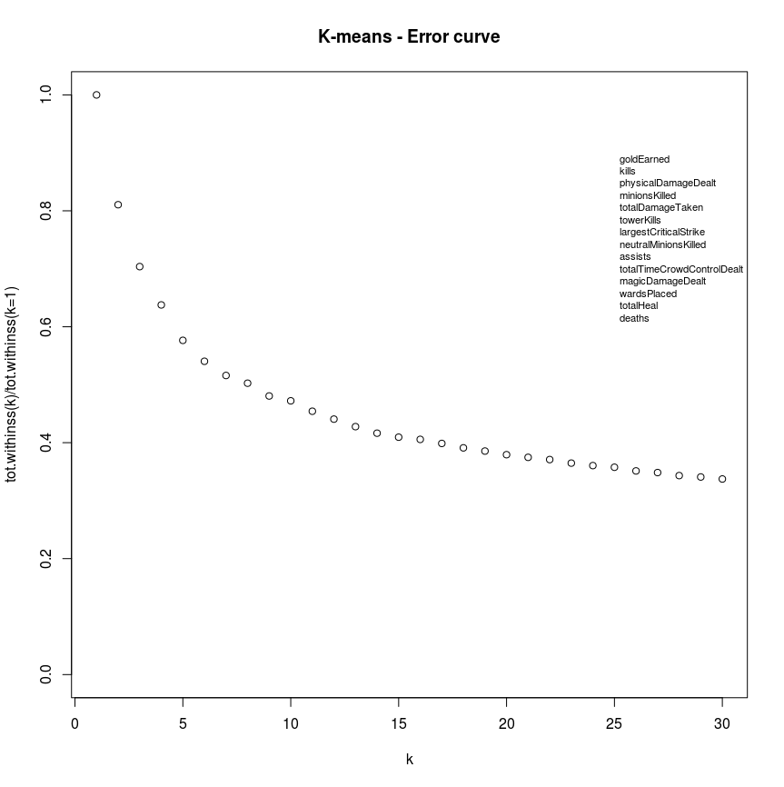
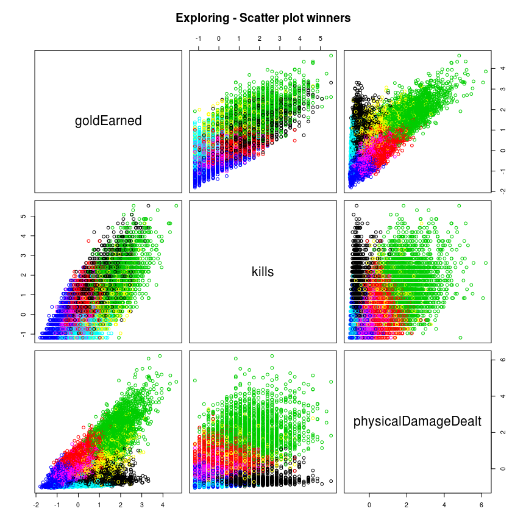
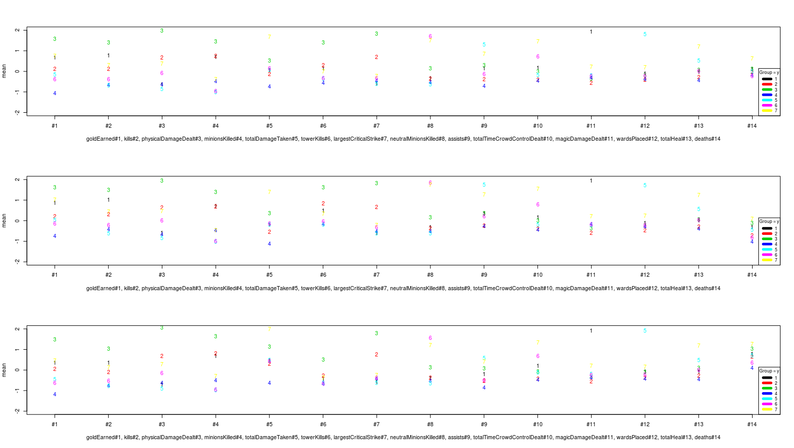

# Data visualization

Table of contents

  1. [Outliers analysis](#outliers-analysis)
  2. [Correlation analysis](#correlation-analysis)
  3. [Clustering analysis](#clustering-analysis)
  4. [Hypothesis testing](#hypothesis-testing)
  5. [Exploring labeled data](#exploring-labeled-data)

## Outliers analysis

[⬆ back to top](data-visualization)

## Correlation analysis

[⬆ back to top](data-visualization)

## Clustering analysis

 [⬆](data-visualization)

[⬆ back to top](data-visualization)

## Hypothesis testing

[⬆ back to top](data-visualization)

## Exploring labeled data
 [⬆](data-visualization)
 [⬆](data-visualization)
 [⬆](data-visualization)
 [⬆](data-visualization)
 [⬆](data-visualization)

[⬆ back to top](data-visualization)

[//]: # "Workaround in Python to make this file:"
[//]: # "plots = [' [⬆](data-visualization)\n' % plot for plot in os.listdir('.') if '.png' in plot]"
[//]: # "with open('README.md', 'w') as f: f.writelines(sorted(plots))"
